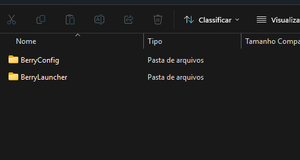
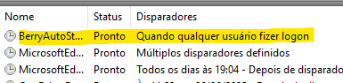

# BerryBrowse

  

  Launcher de automação em Java que prepara seu ambiente de trabalho abrindo links automaticamente no logon do PC.

 <i>Because sometimes you just need a <strong>berry</strong> fresh start.</i>

## Sobre
O BerryBrowse tem como foco automatizar a abertura de links no navegador padrão do usuário. Toda a operação é feita via terminal (CLI) e executada de forma autônoma. O projeto foi arquitetado de forma modular, com responsabilidades separadas em pacotes que cuidam de estruturas específicas.

Além do armazenamento leve de dados direto no disco, o BerryBrowse utiliza o Agendador de Tarefas do Windows para automatizar sua execução no logon do sistema, permitindo a abertura automática de links no início da sessão.

## Funcionalidades

* Execução Portátil: O programa é standalone e contém todas as dependências necessárias para execução nativa, sem necessidade de instalação do JDK/JRE na máquina do usuário.

* Execução em segundo plano: O BerryBrowse é iniciado automaticamente no logon do sistema via Agendador de Tarefas do Windows, executando sua lógica de forma autônoma.

* Persistência de Links: Armazenamento e leitura de URLs através de um arquivo de texto simples (.txt), utilizando o modelo de <i>Flat-File Database</i>.

  
## Requisitos
* **Sistema Operacional:** Windows 10 ou Windows 11 (O funcionamento via Agendador de Tarefas foi homologado e testado nessas versões).

* **Armazenamento (Recomendado):**  SSD.

* **Nota sobre performance:** O BerryBrowse é leve. No entanto, como a automação é engatilhada no momento do logon do Windows, computadores com inicialização muito lenta (como os que utilizam HDDs antigos) podem atrasar o acionamento da ferramenta devido aos gargalos naturais do sistema operacional nesses cenários. 

## Links não permitidos
**Hosts vazios** •
**Hosts númericos** •
**Schemes diferentes de http/https** 

## Instalação
1. Baixe a versão mais recente na aba de Releases do repositório.

2. Como o BerryBrowse é um executável independente (sem assinatura digital paga), o Windows Defender ou seu antivírus pode emitir um alerta. Clique em "Manter" ou "Executar assim mesmo" com segurança.

3. Extraia o arquivo .zip baixado. Você verá duas pastas internas:

  

4. Crie uma pasta chamada BerryBrowse no local do seu PC onde desejar manter o programa e mova as pastas extraídas para dentro dela.

> [!WARNING]
> Não altere o nome de nenhum arquivo e nem troque de lugar, isso irá quebrar o programa.
   
## Configurações Necessárias

1. Você deverá rodar o executável BerryConfig.exe pela primeira vez.

> [!CAUTION]
> O BerryConfig deve ser rodado no terminal ou CMD com níveis de ADMINISTRADOR somente.

 2. Após configurado pelo terminal, abra o Agendador de Tarefas do Windows e cheque se a tarefa "BerryAutoStart" foi criada. Deverá estar assim:

  

3. Agora você pode reiniciar o PC e ver se funcionou.

> Nota: É normal que, ao iniciar, abra uma caixinha do CMD e não tenha nenhum aviso. É apenas o programa pensando.

## Possíveis Ajustes

Se, por algum motivo, houver atraso na inicialização do BerryBrowse ou impacto no desempenho do sistema, recomenda-se ajustar as configurações diretamente no Agendador de Tarefas do Windows.

<ol>
  <li>Para alterar o momento de inicialização, clique com o botão direito em <b>BerryAutoStart</b> → <b>Propriedades</b> → <b>Disparadores</b> → <b>Editar</b>.</li>

  <li>Verifique se a opção <i>"Interromper a tarefa se ela for executada por mais de 3 dias"</i> está desmarcada em <b>Propriedades → Configurações</b> da tarefa <b>BerryAutoStart</b>.</li>
</ol>

## Próximas Implementações

🫐 Berry Moods: perfis de automação (ex: Trabalho, Estudo, Lazer)

🫐 Migração para SQLite para melhor estrutura de dados

🫐 Interface gráfica com JavaFX

🫐 Suporte expandido para Linux

🫐 Logs de execução e monitoramento de automações

🫐 Sistema de backup e restauração de configurações

  

