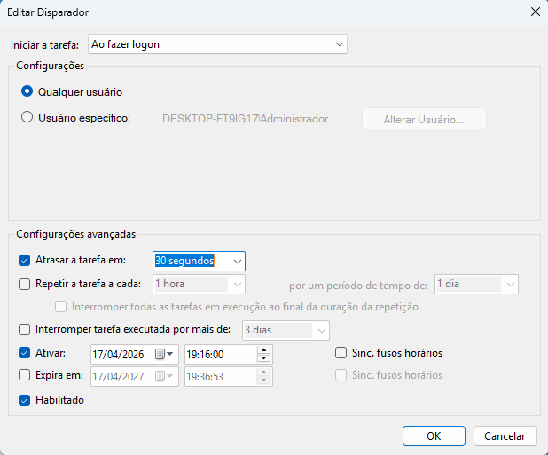

# BerryBrowse

  

  Launcher de automação em Java que prepara o ambiente de trabalho do usuário abrindo links automaticamente no logon do sistema.

 <i>Because sometimes.. you just need a <strong>berry</strong> fresh start!</i>

  
  
  
  

## Sobre

O BerryBrowse tem como foco automatizar a abertura de links no navegador padrão do usuário. Toda a operação é feita via terminal (CLI) e executada de forma autônoma. O projeto é modular, com responsabilidades separadas em packages que organizam as funcionalidades internas.

## Funcionalidades

* **Execução Portátil:** O programa é standalone e contém todas as dependências necessárias para execução nativa, sem necessidade de instalação do JDK/JRE na máquina do usuário.
* **Background Execution:** O BerryBrowse cria automaticamente uma tarefa no Agendador de Tarefas do Windows durante a configuração inicial, garantindo sua execução automática no logon do sistema de forma autônoma.
* **Persistência de Links:** Processamento (limpeza), armazenamento e leitura de URLs em arquivo de texto simples (.txt), utilizando o modelo Flat-File Database.</i>

## Requisitos
* **Sistema Operacional:** Windows 10 ou Windows 11 (O funcionamento via Agendador de Tarefas foi homologado e testado nessas versões).

* **Armazenamento (Recomendado):**  SSD.

> [!NOTE]
> O BerryBrowse é leve. No entanto, como a automação é engatilhada no momento do logon do Windows, computadores com inicialização muito lenta (como os que utilizam HDDs antigos) podem atrasar o acionamento da ferramenta devido aos gargalos naturais do sistema operacional nesses cenários.

## Links não permitidos

**- Hosts vazios**               
**- Hosts numéricos (IPs)**                                                       
**- Schemes diferentes de `http/https`**                                              
**- Links vazios são ignorados**  
**- Links repetidos são contabilizados apenas uma vez**

| ✔ Aceitos | ❌ Rejeitados |
|----------|--------------|
| https://www.google.com | 8.8.8.8 |
| https://www.udemy.com/ | udemy.com |

## Instalação
1. Baixe a versão mais recente na aba do [repositório](https://github.com/SEU_USUARIO/SEU_REPO/releases/latest).

2. Como o BerryBrowse é um executável independente (sem assinatura digital paga), o Windows Defender ou seu antivírus pode emitir um alerta. Clique em "Manter" ou "Executar assim mesmo" com segurança.

3. Extraia o arquivo .zip baixado. Você verá duas pastas internas:

  

4. Crie uma pasta chamada `BerryBrowse` no local do seu PC onde desejar manter o programa e mova as pastas extraídas para dentro dela.

> [!CAUTION]
> **A pasta principal "BerryBrowse" pode ser movida livremente, mas a estrutura interna de arquivos e pastas do BerryConfig e BerryLauncher não deve ser alterada.**

## Configuração inicial

1. Execute o arquivo `BerryConfig.exe` na primeira utilização do sistema.
> [!WARNING]
> **BerryConfig deve ser executado via Prompt de Comando (CMD) ou terminal com permissões de administrador.**

2. Após a execução, abra o **Agendador de Tarefas do Windows** e verifique se a tarefa `BerryAutoStart` foi criada corretamente.

  

3. Confirmado a criação da tarefa, reinicie o computador para validar o funcionamento do BerryBrowse.

## Possíveis Ajustes
Em alguns cenários, o BerryBrowse pode ser executado muito rapidamente durante a inicialização do Windows, antes que processos essenciais como `explorer.exe` e outros serviços do sistema estejam totalmente carregados. Isso pode afetar temporariamente sessões autenticadas que dependem da inicialização completa do sistema.

Nesses casos, recomenda-se configurar um pequeno atraso na tarefa de inicialização. Um delay de aproximadamente 30 segundos costuma ser suficiente na maioria dos ambientes.

  

## Próximas Implementações

🫐 Berry Moods: perfis de automação (ex: Trabalho, Estudo, Lazer)

🫐 Migração para SQLite para melhor estrutura de dados

🫐 Interface gráfica com JavaFX

🫐 Suporte expandido para Linux

🫐 Logs de execução e monitoramento de automações

🫐 Sistema de backup e restauração de configurações

  

